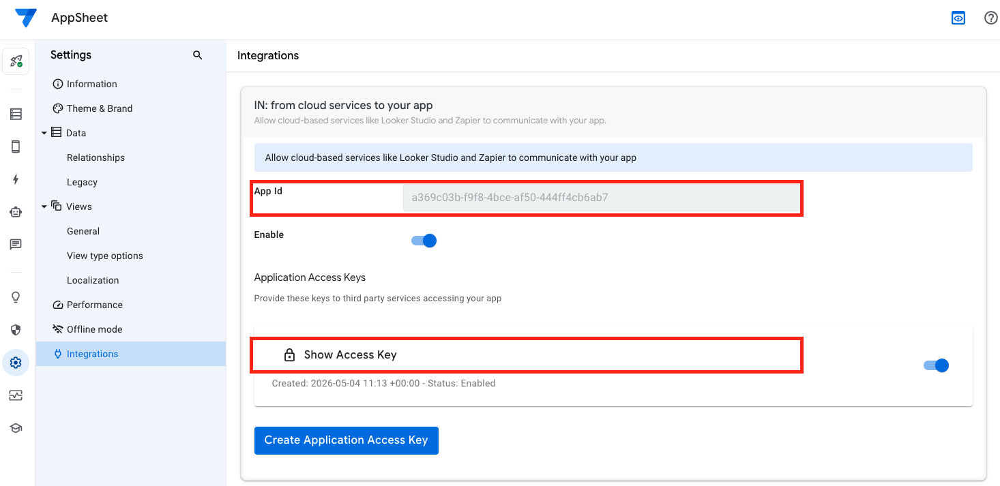

# AppSheet MCP Server

[](https://www.npmjs.com/package/appsheet-mcp-server)
[](https://smithery.ai/server/appsheet)
[](https://opensource.org/licenses/MIT)

Open-source [MCP](https://modelcontextprotocol.io) server for **Google AppSheet** — lets any AI assistant query, write, and automate your AppSheet apps through natural language.

## Features

- 🔍 **CRUD** — Find, add, update, delete rows in any table
- 📋 **Schema Discovery** — List tables and infer column structure
- ⚡ **Actions & Automations** — Trigger custom AppSheet actions and bots
- 🏢 **Multi-App** — Configure multiple apps with one server
- 🔒 **Secure** — API keys stay local, never sent to the AI model

## Quick Start

### 1. Get Your Credentials



1. Open your app → **Settings (⚙️) → Integrations**
2. Turn **Enable** on under *IN: from cloud services to your app*
3. Copy the **App Id** and **Access Key** (starts with `V2-`)

### 2. Connect to Your AI Assistant

Add to your MCP config (Claude, VS Code, Gemini, Cursor — all use this format):

```json
{
  "mcpServers": {
    "appsheet": {
      "command": "npx",
      "args": ["-y", "appsheet-mcp-server"],
      "env": {
        "APPSHEET_APP_ID": "your-app-id",
        "APPSHEET_API_KEY": "V2-your-api-key",
        "APPSHEET_REGION": "global"
      }
    }
  }
}
```

> Region options: `global` (default), `eu`, `apac`

### 3. Start Asking

> "Show me all active customers"
> "Add a new order for Acme Corp, 50 widgets"
> "Update order #123 status to Shipped"
> "Run the Send Invoice action on order #456"
> "What tables does my app have?"

## Tools (10)

| Category | Tool | What it does |
|----------|------|-------------|
| **CRUD** | `appsheet_find_rows` | Query rows with optional filter |
| | `appsheet_add_rows` | Add one or more rows |
| | `appsheet_update_rows` | Update rows by key column |
| | `appsheet_delete_rows` | Delete rows by key column |
| **Schema** | `appsheet_list_apps` | List configured apps |
| | `appsheet_list_tables` | List tables (live discovery) |
| | `appsheet_describe_table` | Infer columns from sample data |
| **Actions** | `appsheet_run_action` | Execute a custom action |
| | `appsheet_run_workflow` | Trigger an automation/bot |
| **Utility** | `appsheet_get_app_info` | App config summary |

## Filter Expressions

```
[Status] = "Active"
[Total] > 1000
AND([Date] >= "2025-01-01", [Date] <= "2025-12-31")
CONTAINS([Name], "Smith")
```

[Full expression syntax →](https://support.google.com/appsheet/topic/10589072)

## Multi-App Config

For multiple apps, create `~/.appsheet-mcp.json`:

```json
{
  "apps": {
    "crm": {
      "appId": "abc-123",
      "apiKey": "V2-xxxxx",
      "region": "global"
    },
    "inventory": {
      "appId": "def-456",
      "apiKey": "V2-yyyyy",
      "region": "eu"
    }
  }
}
```

## Environment Variables

| Variable | Required | Default | Description |
|----------|:--------:|---------|-------------|
| `APPSHEET_APP_ID` | Yes* | — | App ID |
| `APPSHEET_API_KEY` | Yes* | — | Access key |
| `APPSHEET_REGION` | No | `global` | `global` / `eu` / `apac` |
| `APPSHEET_TABLES` | No | — | Comma-separated table names |
| `APPSHEET_CONFIG_PATH` | No | `~/.appsheet-mcp.json` | Multi-app config path |
| `APPSHEET_DEBUG` | No | `false` | Debug logging to stderr |

*Required unless using a config file.

## Web App (No Install)

Don't want to use a terminal? The **AppSheet Chat** web app runs entirely in Google Apps Script with a built-in chat UI.

- **8 tools** — CRUD, schema, and actions
- **3 LLM providers** — Gemini, OpenAI, Claude
- **Zero install** — just paste credentials and chat

[Open Web App →](https://script.google.com/u/0/home/projects/1LierNqciZQI_bX5uOsw46hAYN3JGwMm3R0EHXr3vMxfchpEOuspiVYlF/edit)

## Limitations

- **Schema is inferred** — no column schema endpoint exists; types are guessed from sample data
- **Actions can't be listed** — you must know the exact action name from the AppSheet editor
- **Writes can silently fail** — if AppSheet returns 200 but commits 0 rows, check that API updates are enabled and required columns are provided

> [AppSheet API docs →](https://support.google.com/appsheet/answer/10105557)

## Troubleshooting

| Error | Fix |
|-------|-----|
| **403** | Check API key + ensure API is enabled in Settings → Integrations |
| **404** | Table name is case-sensitive — verify exact name |
| **0 rows committed** | Enable updates: Data → table → "Are updates allowed?" |

## License

MIT © [Islom Ilkhomov](https://github.com/IslomIlkhomov)
